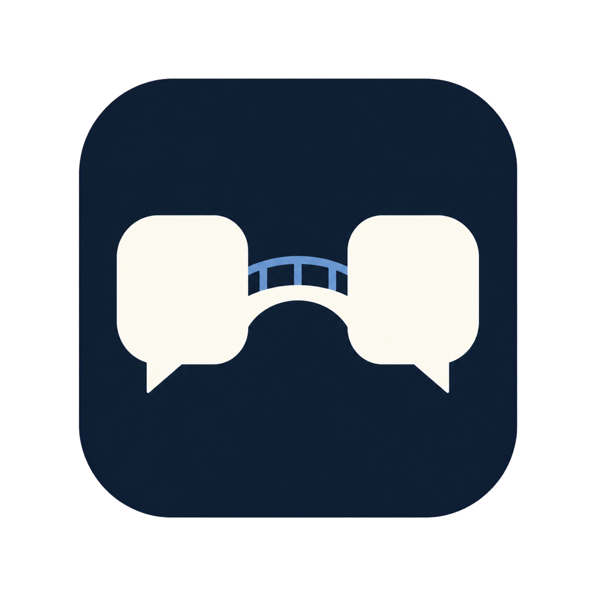

<p align="center">
  
</p>

<h1 align="center">Messages Bridge</h1>

<p align="center"><strong>Make Apple Messages programmable from Codex, Claude Code, Cursor, and any local MCP client.</strong></p>

<p align="center">
  <a href="https://github.com/vishaldubey01/messages-bridge/releases/latest">Download for macOS</a>
  ·
  <a href="#quick-start">Quick start</a>
  ·
  <a href="#how-it-works">How it works</a>
  ·
  <a href="#privacy-and-security">Privacy</a>
</p>

Messages Bridge turns the Messages app on your Mac into a focused set of tools for AI agents. Your agent can find unread texts, catch you up on a group chat, understand attachments, and send replies through the same skills and automations you already use.

Try prompts like:

> Show me every unread text from the past seven days, grouped by conversation. Tell me which ones look like they need a reply.

> Catch me up on the project group chat. Include decisions, open questions, and anything assigned to me.

> Read the latest attachment from Jordan, explain what it is, and draft a reply. Do not send it yet.

> Send “Running five minutes late, sorry!” to Jordan.

## Quick start

Messages Bridge requires macOS 13 or newer, Apple silicon or Intel, and Messages configured on the Mac.

1. Download the latest `Messages-Bridge-*.dmg` from [GitHub Releases](https://github.com/vishaldubey01/messages-bridge/releases/latest).
2. Open the DMG and drag **Messages Bridge** to **Applications**.
3. Open the app and click **Finish setup**.
4. Allow Contacts access, connect the detected AI clients, and enable Messages Bridge in the Full Disk Access page that opens. macOS requires that last toggle to be enabled manually.
5. Return to Messages Bridge and click refresh. Start a new Codex, Claude Code, or Cursor Agent session and ask it to use Messages Bridge.

Reading is on by default. Sending is off until you choose a policy from the menu bar:

| Sending mode | Behavior |
| --- | --- |
| **Off** | No connected client can send a message. |
| **Ask Before Sending** | Messages Bridge shows a native confirmation for every send. |
| **Send Automatically** | Clear send requests run without another Messages Bridge confirmation. |

The first send also triggers macOS's one-time Automation permission for the Messages app.

## What it can do

| Capability | What your agent gets |
| --- | --- |
| Unread inbox | Unread direct and group messages across a time range, without marking them read |
| Conversations | Recent one-to-one and group chats with resolved names, participants, activity, and unread counts |
| Direct and group history | Paginated message text, senders, timestamps, and attachment metadata |
| Attachments | Inline images and audio, local JPEG conversion for HEIC/HEIF/TIFF, plus originals and Quick Look previews for PDFs, videos, and other files |
| Sending | Policy-controlled text messages to an exact contact or selected group |
| Integrations | One-click user-level setup for Codex, Claude Code, and Cursor, plus standard STDIO MCP configuration for other clients |

The 500-message limit is a page size, not a conversation-history cap. When more history exists, the bridge returns a `nextCursor` so the client can continue page by page.

Messages Bridge currently sends text only. It does not send attachments, edit or delete messages, run arbitrary SQL, or expose arbitrary file paths.

## Why a bridge?

Codex, Claude Code, and Cursor do not expose Apple Messages as a native data source. Without Messages Bridge, a local agent would need broad filesystem access plus custom code for Apple's private database schema, Contacts resolution, attachment conversion, and Messages automation.

Messages Bridge packages that work into stable, named MCP tools. The native app owns the macOS permissions and sending policy. The AI client only invokes the specific operations the bridge exposes.

## How it works

```text
Codex / Claude Code / Cursor / MCP client
               │
               │ STDIO MCP
               ▼
MessagesBridgeMCP
               │
               │ same-user Unix socket
               ▼
Messages Bridge.app
   ├── reads chat.db in read-only mode
   ├── resolves names through Contacts
   ├── converts and previews attachments locally
   └── sends approved text through Messages
```

The helper is bundled with the app and has no Python or Node.js dependency. It starts Messages Bridge in the background when needed.

### Available MCP tools

- `messages_bridge_status`
- `messages_list_conversations`
- `messages_list_unread`
- `messages_read_thread`
- `messages_list_groups`
- `messages_read_group`
- `messages_read_attachment`
- `messages_read_group_attachment`
- `messages_send_text`
- `messages_send_group_text`

## Cursor

The app connects both Cursor IDE and Cursor Agent CLI by adding one user-level entry to `~/.cursor/mcp.json`. Existing MCP servers and other top-level settings are preserved. If that file contains invalid JSON, Messages Bridge stops and shows an error instead of overwriting it.

Cursor uses the same global MCP file for the IDE and Agent CLI, so no project-by-project setup is needed. See [Cursor's MCP documentation](https://docs.cursor.com/context/model-context-protocol).

## Other MCP clients

Messages Bridge can copy a configuration using its current app location. The equivalent configuration for an app installed in `/Applications` is:

```json
{
  "mcpServers": {
    "messages-bridge": {
      "command": "/Applications/Messages Bridge.app/Contents/MacOS/MessagesBridgeMCP",
      "args": []
    }
  }
}
```

If you installed the app in `~/Applications`, use that path instead.

## Codex plugin

The app can connect Codex directly. This optional plugin adds instructions that help Codex choose the right Messages Bridge tools and handle paginated history safely:

```bash
codex plugin marketplace add vishaldubey01/messages-bridge
codex plugin add messages-bridge@messages-bridge
```

Install and connect the native app first. Claude Code and Cursor do not need a plugin.

## Attachment behavior

HEIC, HEIF, TIFF, and other macOS-decodable image formats are converted locally to JPEG when the MCP client cannot render them. PDFs, videos, and other files up to 20 MB keep their original bytes and include a JPEG preview when macOS Quick Look supports the format.

For larger previewable files, the bridge returns metadata and a local preview without embedding the original. MCP does not define an inline video player, so videos are delivered as the original resource plus a preview frame when size permits.

## Privacy and security

Messages Bridge itself has no networking, analytics, or telemetry. It opens the Messages database read-only, limits attachment access to the selected conversation, and communicates with the MCP helper over a Unix socket restricted to the signed-in user.

Your connected AI client may transmit requested tool results to its model provider. Its privacy terms and data controls still apply.

Read [Privacy](PRIVACY.md) for the data boundary and [Security](SECURITY.md) for the threat model and vulnerability reporting process.

## Build from source

The development build is ad-hoc signed and installs to `$HOME/Applications`:

```bash
git clone https://github.com/vishaldubey01/messages-bridge.git
cd messages-bridge
./scripts/build_bridge.sh
open "$HOME/Applications/Messages Bridge.app"
```

Changing the signing identity or bundle identifier can make macOS request privacy permissions again. For Developer ID signing and notarization, see [Distribution](docs/DISTRIBUTION.md).

Contributions are welcome. Read [Contributing](CONTRIBUTING.md) before opening a pull request.

## License

MIT. See [LICENSE](LICENSE).
